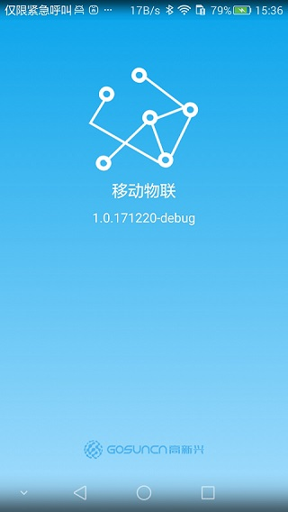
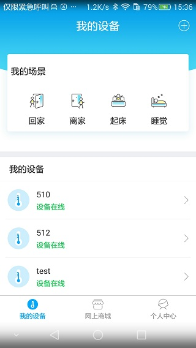
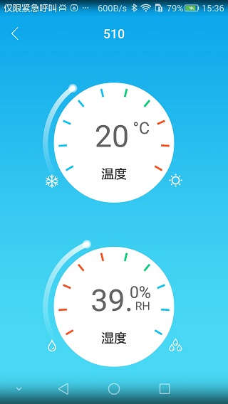
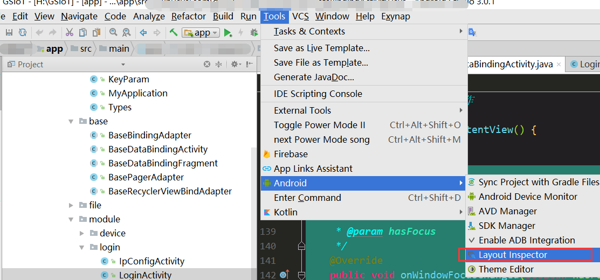
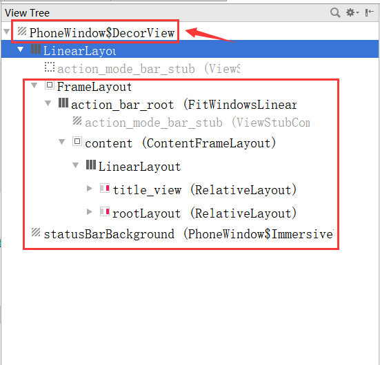

### Android statusBar 开发问题汇总


#### 适配有虚拟按键的手机，比如华为荣耀系列手机
   手机开屏出现白屏和黑屏的解决方法是在开屏的Activity中进行设置自定义的主题：
   ```xml
 <!-- 防止欢迎页白屏或者黑屏，设置图片或者渐变drawable -->
    <style name="AppTheme.SplashTheme">
        <!--最先呈现给用户查看-->
        <item name="android:windowBackground">@drawable/shape_bg_start_page</item>
        </style>
```
   在其他手机上如上诉代码设置即可，但在华为手机上会发现虚拟按钮及顶部statusBar跟自己设置的主题颜色很不协调。其颜色
   默认为 ** 黑底白字 **。
   可以添加如下代码进行设置：
   
   ```xml
<!-- 防止欢迎页白屏或者黑屏，设置图片 -->
    <style name="AppTheme.SplashTheme">
        <!--最先呈现给用户查看-->
        <item name="android:windowBackground">@drawable/shape_bg_start_page</item>
        <!--考虑华为手机虚拟按键的显示-->
        <item name="android:windowTranslucentNavigation">true</item>
        <item name="android:windowTranslucentStatus">true</item>
    </style>
```
<!--more-->
最后得到如图
    



* 可从图片上观察到虚拟按键和statuBar的背景色和自定义的主题色进行了很好的== 拉伸过渡==
#### 设置statusBar颜色 适配4.4以上系统
但实现上述的效果图，可不仅仅依靠上面两行代码，上面两行代码只是针对开屏页进行了设置。** 后续界面的实现请看下面代码： **
为了考虑不同手机的兼容性及不同api（api>=19 即adnroid 4.4版本）,不同手机版本的statusBar的高度各有不同，所以按如下步骤进行处理：
- ** 第一步：获取statusbar的高度**
  参考如下代码：
  ```java
    /**
     * 获取状态栏高度
     *
     * @param context context
     * @return 状态栏高度
     */
    public static int getStatusBarHeight(Context context) {
        int result = -1;
        int resourceId = context.getResources().getIdentifier("status_bar_height", "dimen", "android");
        if (resourceId > 0) {
            result = context.getResources().getDimensionPixelSize(resourceId);
        }
        return result;
    }
 ```
 以上工具类方法可从 [CommonUtil库](https://github.com/GosuncnMobile/BaseLibrary/blob/master/util/src/main/java/com/gosuncn/core/util/view/StatusBarUtils.java)进行获取。
 
- ** 第二步：创建一个和statusBar高度一致的颜色块**
 ```java
    /**
     * 生成一个和状态栏大小相同的矩形条
     *
     * @param activity 需要设置的activity
     * @param color    状态栏颜色值
     * @return 状态栏矩形条
     */
    private static View createStatusBarView(Activity activity, int color) {
        // 获得状态栏高度
//        int resourceId = activity.getResources().getIdentifier("status_bar_height", "dimen", "android");
//        int statusBarHeight = activity.getResources().getDimensionPixelSize(resourceId);
        int statusBarHeight = StatusBarUtils.getStatusBarHeight(activity);
        Log.e(TAG, "createStatusView: statusBarHeight = " + statusBarHeight);
        // 绘制一个和状态栏一样高的矩形
        View statusView = new View(activity);
        LinearLayout.LayoutParams params = new LinearLayout.LayoutParams(ViewGroup.LayoutParams.MATCH_PARENT,
                statusBarHeight);
        statusView.setLayoutParams(params);
        statusView.setBackgroundColor(color);
        return statusView;
    }
```

- ** 第三步：设置statusBar透明，添加自定义statusBar 颜色 **

```java
    //使状态栏透明
    @TargetApi(Build.VERSION_CODES.KITKAT)
    public static void transparentStatusBar(Activity activity, int color) {
        if (Build.VERSION.SDK_INT >= Build.VERSION_CODES.KITKAT) {//4.4 全透明状态栏
            //  这个属性4.4算是全透明（有的机子是过渡形式的透明），5.0则是半透明，某些手机则是全透明。
            activity.getWindow().addFlags(WindowManager.LayoutParams.FLAG_TRANSLUCENT_STATUS);
            activity.getWindow().addFlags(WindowManager.LayoutParams.FLAG_TRANSLUCENT_NAVIGATION);

        }

        if (Build.VERSION.SDK_INT >= Build.VERSION_CODES.LOLLIPOP) {//5.0 全透明实现
            Window window = activity.getWindow();
            //// 因为EMUI3.1系统与这种沉浸式方案API有点冲突，会没有沉浸式效果。
            // 所以这里加了判断，EMUI3.1系统不清除FLAG_TRANSLUCENT_STATUS
            if (!isEMUI3_1()) {
                window.clearFlags(WindowManager.LayoutParams.FLAG_TRANSLUCENT_STATUS);
            }
            window.addFlags(WindowManager.LayoutParams.FLAG_DRAWS_SYSTEM_BAR_BACKGROUNDS);
            window.setStatusBarColor(Color.TRANSPARENT);
            window.setNavigationBarColor(Color.TRANSPARENT);
        }

        Log.e(TAG, "transparentStatusBar: color = " + color);
        if (Build.VERSION.SDK_INT >= Build.VERSION_CODES.M) {
            boolean isLightTheme = false;
            Window window = activity.getWindow();
            for (int i = 0; i < lightColors.length; i++) {
                int selectColor = activity.getColor(lightColors[i]);
                if (selectColor == color) {
                    isLightTheme = true;
                    break;
                }
            }
            //如果是白色系列主题，则设置为黑字，默认是白字
            if (isLightTheme) {
                window.getDecorView().setSystemUiVisibility(View.SYSTEM_UI_FLAG_LIGHT_STATUS_BAR);
            }

        }
    }

    public static boolean isEMUI3_1() {
        if ("EmotionUI_3.1".equals(getEmuiVersion())) {
            return true;
        }
        return false;
    }

    private static String getEmuiVersion() {
        Class<?> classType = null;
        try {
            classType = Class.forName("android.os.SystemProperties");
            Method getMethod = classType.getDeclaredMethod("get", String.class);
            return (String) getMethod.invoke(classType, "ro.build.version.emui");
        } catch (ClassNotFoundException e) {
            e.printStackTrace();
        } catch (NoSuchMethodException e) {
            e.printStackTrace();
        } catch (IllegalAccessException e) {
            e.printStackTrace();
        } catch (InvocationTargetException e) {
            e.printStackTrace();
        } catch (Exception e) {
            e.printStackTrace();
        }
        return "";
    }
```
##### 对上述代码修改补充(2017/12/27)：华为EMUI3.1系统 statusBar 的特殊处理

- ** 第四步：设置statusBar颜色 **

``` java
		//设置状态栏颜色
       public static void setColor(Activity activity, int color) {
        if (Build.VERSION.SDK_INT >= Build.VERSION_CODES.KITKAT) {
            // 设置状态栏透明
            //  activity.getWindow().addFlags(WindowManager.LayoutParams.FLAG_TRANSLUCENT_STATUS);
            transparentStatusBar(activity);
            // 生成一个状态栏大小的矩形
            View statusView = createStatusBarView(activity, color);
            // 添加 statusView 到布局中
            ViewGroup decorView = (ViewGroup) activity.getWindow().getDecorView();
            decorView.addView(statusView);
            //   设置根布局的参数
            ViewGroup contentLayout = (ViewGroup) ((ViewGroup) 			activity.findViewById(android.R.id.content)).getChildAt(0);
            Log.w(TAG, "setColor: content paddingTop before set = " + contentLayout.getPaddingTop());
            contentLayout.setFitsSystemWindows(true);
            contentLayout.setClipToPadding(true);
            Log.w(TAG, "setColor: content paddingTop after set = " + contentLayout.getPaddingTop());
            //为了适配不同手机的情况，可以在基类activity 中监听onWindowsFocusChange()看看根布局的padding是否等于
            //statusBar的高度，如果不等于（几乎大部分手机都是相等的，目前遇到的情况是努比亚的手机设置的padingTop特别小，
            // 导致内容布局与statusBar重叠） ，则手动设置paddingTop为statusBar的高度。


        }
    }

	```

- ** 第五步：在基类中设置statusBar (在setContentView(...)之后设置)**


```java
 @Override
    public void afterSetContentView() {
        StatusBarUtil.setColor(this, getResources().getColor(R.color.app_white_bg));
        initViews();
        initData();
    }
```
#### 填坑指南
  ` 关键的一步，主要是努比亚的手机的系统定制的比较特殊，在fitSystemWindow之后，对于根布局contentLayout设置的paddingTop并不等于 statusBar的高度，所以导致了内容布局会与statusBar重叠！！！网上的做法都是说重叠了就设置fitSystemWindow就可以，目前尚无对应的处理方法，所以接下来的解决方法就可能是你苦苦寻求的啦 `
  ```java
    /**
     * 监听是否有设置正常的padding，有一些手机如努比亚手机就不会设置正常的statusBar的高度作为padding，
     * 导致内容布局与statusBar重叠的问题。
     *
     * @param hasFocus
     */
    @Override
    public void onWindowFocusChanged(boolean hasFocus) {
        super.onWindowFocusChanged(hasFocus);
        Log.e(TAG, "onWindowFocusChanged: binding.getRoot().getPaddingTop() = " + binding.getRoot().getPaddingTop());
        if (binding.getRoot().getPaddingTop() != StatusBarUtils.getStatusBarHeight(this)) {
            binding.getRoot().setPadding(0, StatusBarUtils.getStatusBarHeight(this), 0, 0);
        }
    }
```
  ###### 其实解决思路是很简单的，主要是找出问题的根源所在。还有一点就是在写界面布局时，** 注意不要轻易在根布局里面设置paddingTop属性**，经过测试发现，这个** paddingTop**会被系统在fitSystemWindow之后帮你设置为** statusBar的高度**（除了上面那个特殊情况，需要自己设置paddingTop）


#### 附带：一个分析布局的工具Layout Inspector






** 附录·参考文献 **
[该使用 fitsSystemWindows 了](http://blog.chengyunfeng.com/?p=905#ixzz52GUtJQnQ)
[沉浸式状态栏实现及遇到的坑](http://www.liuling123.com/2017/02/transparent-status-bar.html)** (重点推荐！) **


