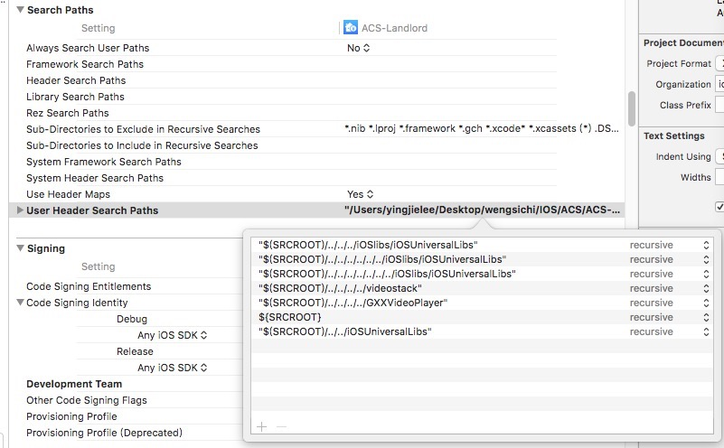
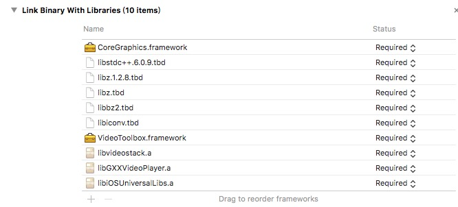
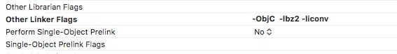
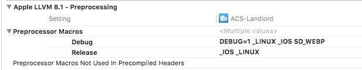
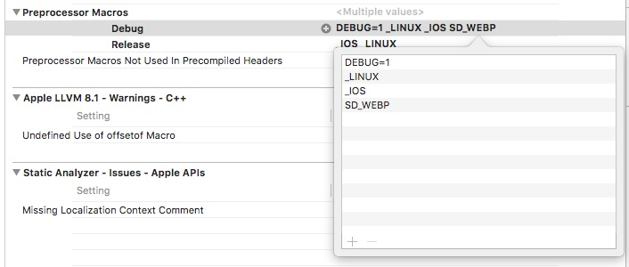
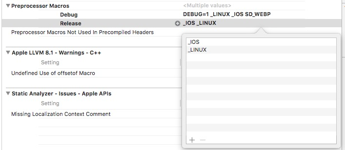
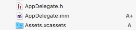

#### 在Link Binary With Libraries中添加libGXXVideoPlayer.a和libvideostack.a两个静态库。
#### 在User Header Search Paths中拖入GXXVideoPlayer和videostack两个库的地址。

#### 在Link Binary With Libraries中加入7个动态库：libstdc++.6.0.9.tbd,libz.1.2.8.tbd,libz.tbd,libbz2.tbd,libiconv.tbd, VideoToolbox.framework,CoreMedia.framework
<!--more-->

#### 在Other Linker Flags添加-ObjC,-lbz2,-liconv（注意大小写）

#### 在Preprocessor Marcos中，Debug添加：DEBUG=1,_LINUX,_IOS,SD_WEBP,Release添加：_IOS,_LINUX

#### 把项目中至少一个文件的.m后缀改成.mm支持c++.（例如修改AppDelegate.m为AppDelegate.mm）

