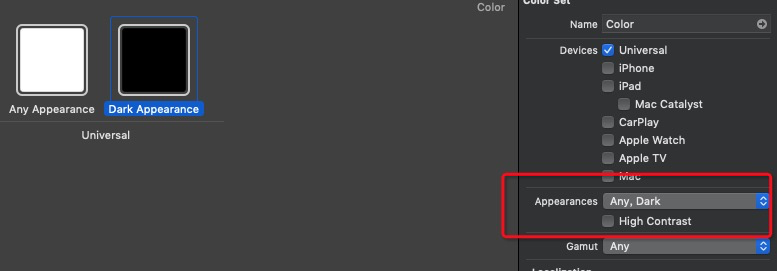
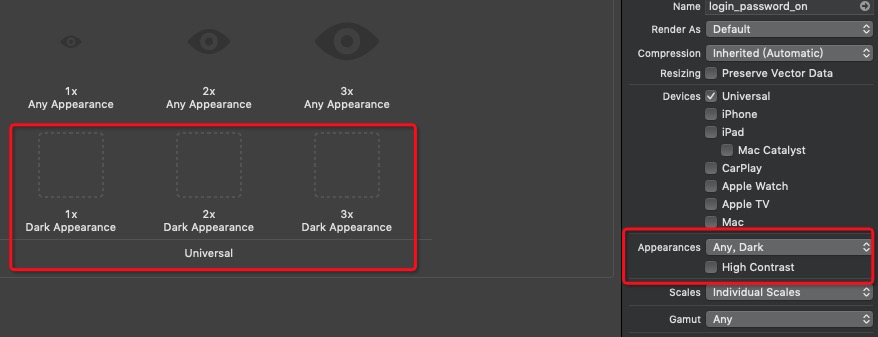

# iOS13
## 需要适配
### UIWebView
UIWebView已经全面废弃.全部升级成WKWebView吧!

### 蓝牙权限
如果需要使用CBCentralManager(蓝牙中心模式),需要新增权限"Privacy - Bluetooth Always Usage Description",值"我们需要通过您的蓝牙权限来XXX"

**xcode11,不加权限iOS13直接卡死**

### [UniversalLink](https://developer.apple.com/library/archive/documentation/General/Conceptual/AppSearch/UniversalLinks.html)
虽然Apple尚未明确完全禁止URL Schema,但是按苹果目前态度,Universal Link必然是大趋势.而且不少第三方SDK(微信,QQ互联等)要支持UniversalLink校验才能跳转.
#### 配置流程
- 新建apple-app-site-association文件(无后缀),内容如下
```json
{
    "applinks": {
        "apps": [],
        "details": [
            {
                "appID": "TeamID.com.apple.aaa",
                "paths": [ "/applinks/aaa/*", "/qq_conn/QQ_ID_aaa/*"]
            },
            {
                "appID": "TeamID.com.apple.bbb",
                "paths": ["/applinks/bbb/*", "/qq_conn/QQ_ID_bbb/*"]
            }
        ]
    }
}
```
- 在**https**域名根目录或者.well-known目录下放该文件
- 在Xcode - TARGETS - Signings & Capabilities - Associated Domains 下加入
```sh
applinks:host
```
- 重新安装APP,用iOS自带浏览器打开https://host/applinks/aaa/aa,如果能跳到aaa的APP,则配置完成
#### 注意事项
- 该文件只会在APP首次安装或更新时获取
- 一个文件可以与多个APP相对应
- paths应该以统配符*结尾
- QQ互联要求额外加上路径"/qq_conn/QQ_ID_bbb/*"

## 新特性
### Dark Mode
iOS13 新出的暗黑(夜间)模式
如果不想适配,可以直接在Info.plist里加上"User Interface Style",值"Light"

#### UIColor
- systemColor
新出了一组UIColor,命名为system color
例如systemGray,systemGray1,systemGray2
这些会会在Dark Mode下自动变色
```swift
view.backgroundColor = UIColor.systemBackground
textview.textColor = UIColor.label
```
- 创建自定义UIColor
```swift
let backgroundColor = UIColor { (trainCollection) -> UIColor in
    if trainCollection.userInterfaceStyle == .dark {
        return UIColor.black
    } else {
        return UIColor.white
    }
}
```
**实际情况下要加上系统版本判断**
```swift
if #available(iOS 13.0, *) {
    contentView.backgroundColor = UIColor.systemBackground
} else {
    contentView.backgroundColor = UIColor.white
}
```
- ColorSet
asserts.xcasset里创建cColorSet,在ColorSet里设置颜色(**ColorSet仅支持11以上,目前不考虑**)

#### CGColor
```Swift
let layoutColor = UIColor.systemBackground.resolvedColor(with: UITraitCollection.init())
copyRightLabel.layer.borderColor = layoutColor.cgColor
```
#### 图片

#### 参考连接
[iOS13-适配夜间模式/深色外观(Dark Mode)](https://juejin.im/post/5cf6276be51d455a68490b26)

[Dark Mode on i​OS 13](https://nshipster.com/dark-mode/)
### [SwiftUI](https://developer.apple.com/xcode/swiftui/)
iOS新的UI框架,DSL式声明语言,可以实时预览

**目前只支持iOS13**

### Compositional Layout
复合UICollectionView布局,可以方便的实现多维瀑布流

**目前只支持iOS13**

参考连接[iOS13 Compositional Layout](https://www.jianshu.com/p/b263f56c69a2)

