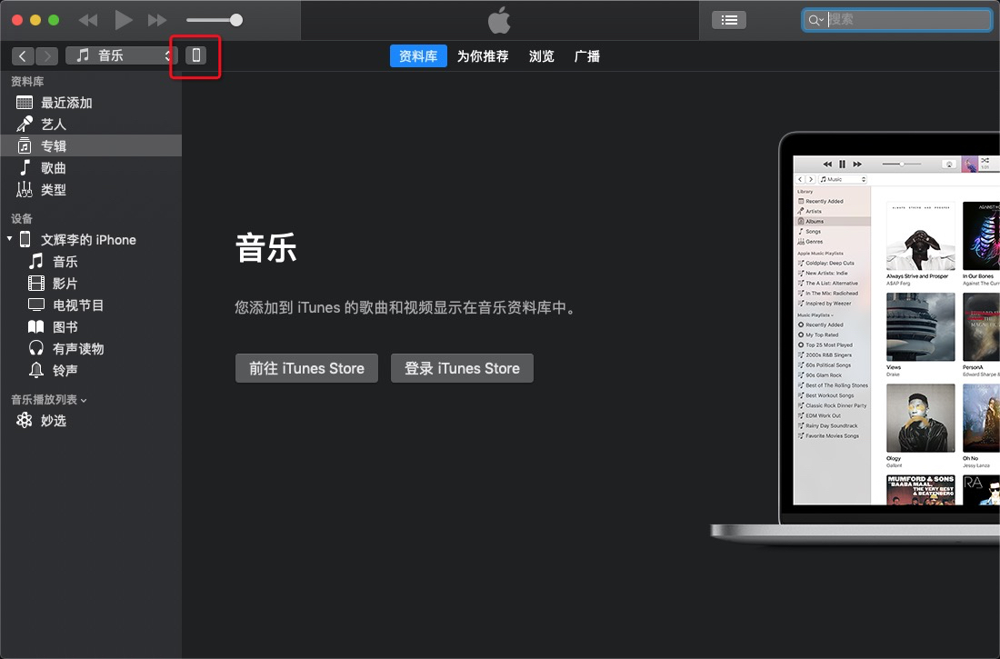
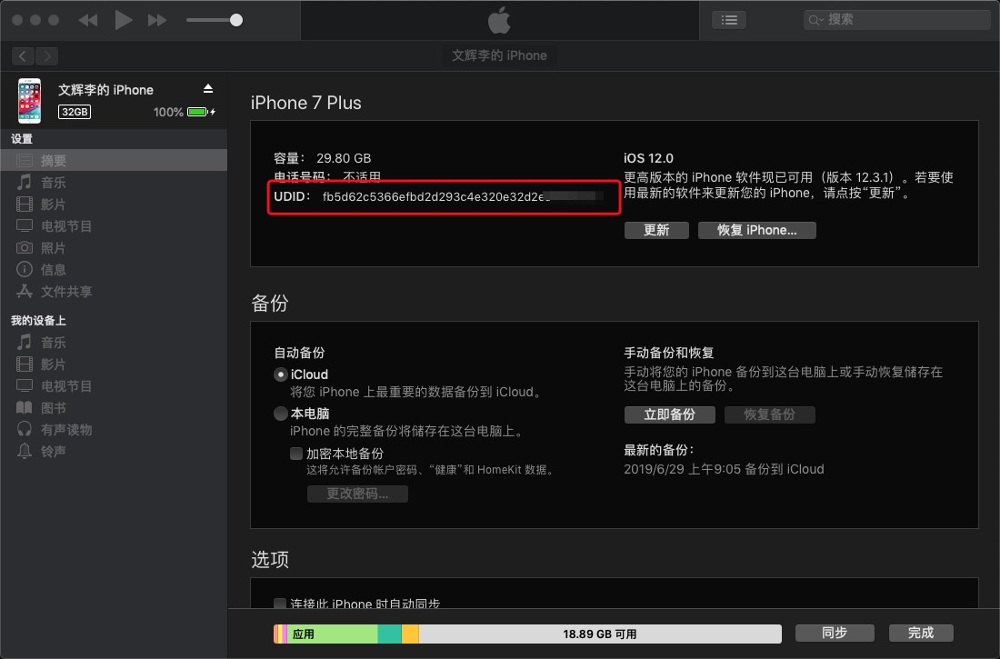
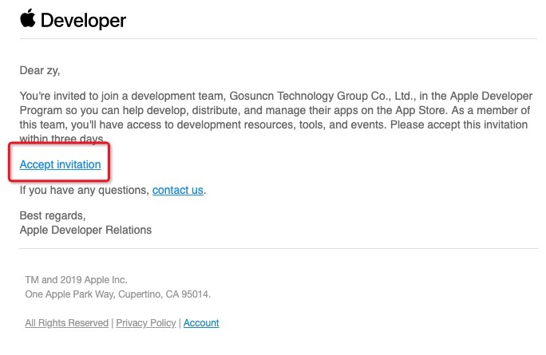
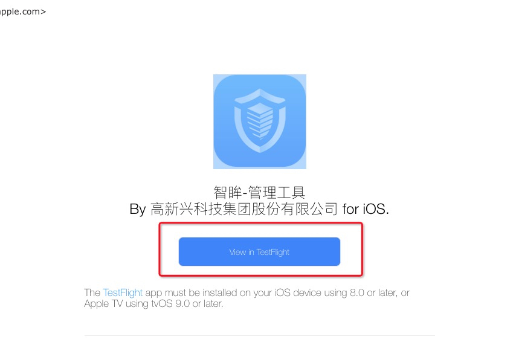
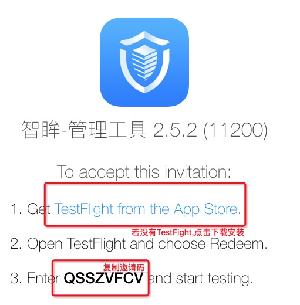
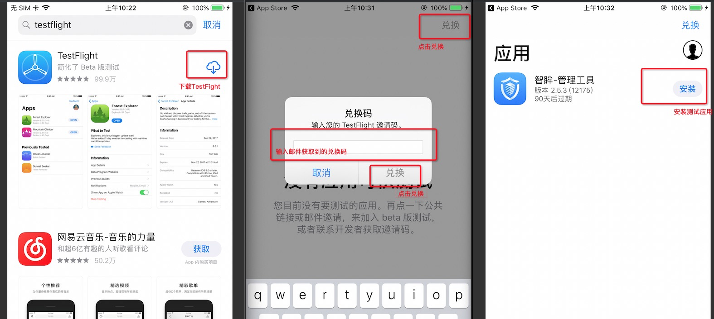
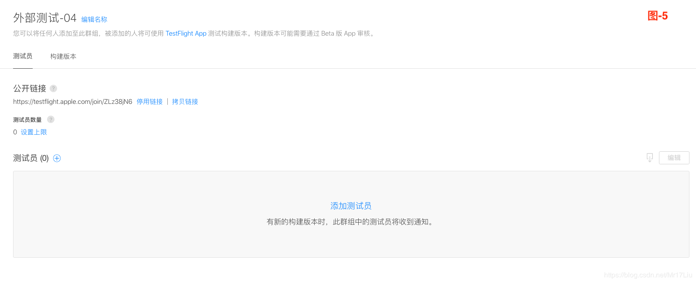

这篇介绍下iOS的测试方式,主要给非开发人员一些操作流程参考.
开发人员可以对应[iOS开发人员构建测试](iOS测试流程.md)来看

## 测试方法

| 方法 | 优点 | 缺点 | 
| ------ | ------ | ------ |
| UUID证书打包 |发包快,只要一打包就能马上能安装|由于证书是直接打包进ipa里的,每增加一台设备都需重新打包.收集UUID流程比较麻烦,也不用户友好|
| TestFight 内部测试|发包速度在1-2小时之内,打包后再添加人员,不需要再打包.需要两次邮箱验证,邮箱验证友好度比收集UUID良好.版本管理可以直接在Apple后台看到.人数上限25.|需要上传到AppleStore然后过机审. 被加入的人员会有一定的管理权限,不适合外部人员.邀请码和AppleId绑定.版本更新会有延迟.|
| TestFight 外部测试|可以通过外部链接直接参与测试,无需收集任何信息给开发人员.(但一样要走TestFight APP).测试账户无额外权限.版本管理可以直接在Apple后台看到.人数上限10,000 .|需要上传到AppleStore然后人工审核.发包速度比较久且不受控制(而且有可能审核失败)|

## UUID证书打包
- 电脑打开iTunes,数据线连接手机
- 点击手机进入手机界面
- 点击序列号那一项,直到出现"UUID:" 把UUID复制给开发人员

或直接iOS手机扫描二维码,就能获取UUID

## TestFight 内部测试
- 把名字,AppleID的邮箱发给开发人员
- 接收第一封邮件,并点击同意成为内部测试人员

- 接收第二封邮件,并点击在TestFight里查看

- 若没有TestFight,必须先下载TestFight
- 填入邀请码,下载安装测试APP

如果再发新版本,可以直接在TestFight更新,无需邮箱验证
会弹新版本推送(苹果说的,但是这个不确定)
## TestFight 外部测试
- 直接向开发人员索要公开链接
- 通过TestFight获取外部测试APP

